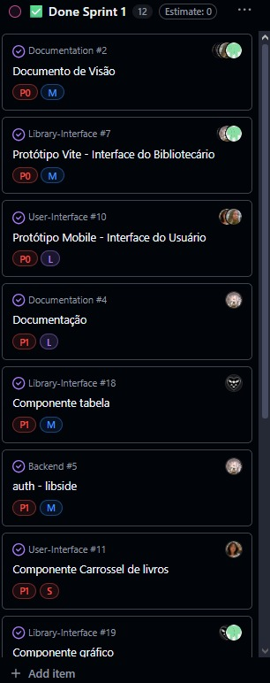

# 1º Sprint (quinzenal)

## Objetivo da sprint:

O objetivo desta sprint é aprimorar a interface do sistema, garantindo uma melhor experiência visual e de navegação para o usuário. As atividades incluem a criação e organização de componentes visuais, ajustes no CSS global, definição de estilos e tipografia, e a implementação de elementos interativos como tabelas, cards e gráficos. Além disso, busca-se consolidar o protótipo no Figma, revisar o backlog do projeto e preparar o ambiente para futuras integrações com autenticação e banco de dados.

## Lista de entregas concluídas:

- Modelo do documento de visão 

- Definição do escopo do projeto

- Público-alvo definido

- Modelo de negócios estruturado

- Protótipo criado no Figma

- Planejamento das sprints concluído

- Criação de interface básica voltada ao usuário do sistema

- Definição da navegação básica e telas acessíveis

- Adição de elementos visuais e UX

- Criação de wireframes das telas principais (login, dashboard e outras páginas de navegação)

- Documentação das interações (botões, navegação entre telas)

- Definição da paleta de cores e tipografia base

- Reescrita do backlog do projeto

- Definição de entregas do projeto

- Criação de componente para tabela de acervo

- Implementação de redirecionamento e requisição na página de autenticação 
(auth page redirection and requisition)

- Criação de credenciais mockadas em .env

- Preparação para futura integração com banco de dados

- Criação do componente Carrossel de livros

- Criação de gráfico de linha para o dashboard

- Criação do componente de código de status dos livros (legenda visual)

- Atribuição de cores distintas para cada situação do livro

- Implementação de pop-up explicativo com a legenda das cores

- Criação de um componente de card básico

- Implementação de estilos globais (CSS global)

- Reorganização da estrutura das páginas do sistema

- Refatoração do CSS existente

- Correção e endereçamento dos inputs

## Indicadores: 

## Impedimentos: 

### Componentização

Observação: Não houve impedimentos nessa sprint.

## Próximos passos para a próxima sprint:

- Backend em Java Spring.

- Criar endpoints para autenticação de usuário.

- Frontend / Componentes.

- Adaptar telas mobile para versão desktop (com base no protótipo do Figma).

- Refatorações.

- Funcionalidades do Usuário.

## Resumo de rastreabilidade:

### Documento de Visão (#2)

Status: Concluído

Repositório: ProjetoIntegradorFour/Documentation

Responsáveis: @thomasteinhoff, @GuilhermeAmargo, @Vetorazzo

Descrição: Criação do modelo do Documento de Visão e definição do escopo do projeto.

Escopo concluído: Público-alvo, Modelo de Negócios, Protótipo Figma e Planejamento das Sprints.

Sub-issue: Projeto de Interfaces FIGMA (#3)

Entrega: Vinculada à Entrega 2 - 22/08

 

### Documentação (#4)

Status: Concluído

Repositório: ProjetoIntegradorFour/Documentation

Responsáveis: @thomasteinhoff, @GuilhermeAmargo

Descrição: Reescrita do backlog e definição das entregas do projeto, visando padronizar e organizar o planejamento.

Escopo concluído: Revisão do documento de backlog e estruturação das entregas.

Entrega: Vinculada à Sprint 1 (Peso 30%)

 

### Auth - Libside (#5)

Status: Concluído

Repositório: ProjetoIntegradorFour/Backend

Responsável: @thomasteinhoff

Descrição: Implementação da autenticação no lado da biblioteca, incluindo redirecionamento da página de login, requisição de autenticação, uso de credenciais mockadas via .env e planejamento para futura integração com banco de dados.

Relacionamento: Associado ao tema Componentes Web (Library-Interface #12)

Entrega: Finalizado na Sprint 1

 

### Protótipo Vite - Interface do Bibliotecário (#7)

Status: Concluído

Repositório: ProjetoIntegradorFour/Library-Interface

Responsáveis: @thomasteinhoff, @GuilhermeAmargo, @Vetorazzo

Descrição: Desenvolvimento da interface inicial voltada ao bibliotecário, definindo navegação, telas principais e elementos visuais e de UX.

Escopo concluído: Criação de wireframes (login, dashboard e 4 telas de navegação) e documentação das interações.

Sub-issue: Atualização / Otimização da tela de login (#14)

Entrega: Vinculada à Sprint 1

 

### Componente Código de Status (#8)

Status: ✅ Concluído

Repositório: ProjetoIntegradorFour/User-Interface

Responsável: @ZKNs1

Colaborador: @GuilhermeAmargo

Descrição: Desenvolvimento de um componente visual de legenda para indicar o status dos livros no sistema. O componente utiliza cores distintas para representar cada situação (ex: disponível, emprestado, reservado) e exibe um pop-up explicativo ao clicar, detalhando o significado de cada cor.

Relacionamento: Vinculado à issue #9 - Componentização

Atividade:

Criado e iniciado em 18 de setembro

Movido para Sprint 1 e posteriormente para ✅ Done Sprint 1

Finalizado por ZKNs1 há 3 semanas

 

### Protótipo Mobile - Interface do Usuário (#10)

Status: Concluído

Repositório: ProjetoIntegradorFour/User-Interface

Responsáveis: @thomasteinhoff, @mwlaofr, @ZKNs1, @GuilhermeAmargo

Descrição: Desenvolvimento do protótipo mobile da interface do usuário, definindo navegação, telas principais e elementos de UX/UI.

Escopo concluído: Criação de wireframes (login, dashboard, configurações), definição de paleta de cores e tipografia base, e protótipo no Figma.

Entrega: Vinculada à Sprint 1

 

### Componente Carrossel de Livros (#11)

Status: Concluído

Repositório: ProjetoIntegradorFour/User-Interface

Responsável: @ZKNs1

Colaborador: @GuilhermeAmargo

Descrição: Desenvolvimento e integração do componente de carrossel para exibição de livros na interface do sistema de gerenciamento de biblioteca, garantindo melhor visualização e navegação entre os itens.

Relacionamento: Vinculado à issue #9 - Componentização

Entrega: Finalizado na Sprint 1 (movido para ✅ Done Sprint 1 em 30 de setembro)

 

### Alteração da Estrutura da Interface do Bibliotecário (#13)

Status: ✅ Concluído

Repositório: ProjetoIntegradorFour/Library-Interface

Responsável: @GuilhermeAmargo

Descrição: Implementação de estilos globais (CSS global) e reorganização da estrutura das páginas da interface voltada para o bibliotecário, garantindo maior consistência visual e padronização entre os componentes.

Atividade:

Iniciado e concluído em 9 de setembro

Movido para 🔍 Review e posteriormente para ✅ Done

Classificado como Task

Adicionado à Entrega 3 - Peso 20% e à Sprint 1 há 3 semanas

 

### Atualização / Otimização da Tela de Login (#14)

Status: ✅ Concluído

Repositório: ProjetoIntegradorFour/Library-Interface

Responsáveis: @GuilhermeAmargo e @thomasteinhoff

Descrição: Refatoração e otimização da tela de login da interface do bibliotecário. Foram realizados ajustes no CSS, endereçamento dos inputs e preparações para integração futura com o sistema de autenticação e banco de dados.

Atividades:

Atribuído a thomasteinhoff

Iniciado e finalizado em 9 de setembro

Movido entre os status ✅ Done, 🔍 Review e novamente ✅ Done

Classificado como Feature e incluído na Entrega 3 - Peso 20% e na Sprint 1 há 3 semanas

 

### Componente Card (#15)

Status: ✅ Concluído

Repositório: ProjetoIntegradorFour/Library-Interface

Responsável: @GuilhermeAmargo

Descrição: Desenvolvimento de um componente de card básico para exibição de informações visuais e textuais dentro da interface do sistema, servindo como base para outros componentes reutilizáveis na aplicação.

Relacionamento: Vinculado à issue #12 - Componentes Web

Atividade:

Criado e concluído em 9 de setembro

Movido para 🔍 Review e posteriormente para ✅ Done

Classificado como Task e adicionado à Sprint 1 há 3 semanas

 

### Componente Tabela (#18)

Status: Concluído

Repositório: ProjetoIntegradorFour/Library-Interface

Responsáveis: @GuilhermeAmargo, @Vetorazzo

Descrição: Desenvolvimento do componente de tabela para exibição do acervo na interface web.

Relacionamento: Subtarefa do issue Componentes Web (#12)

Entrega: Vinculada à Entrega 3 - Peso 20% e finalizada na Sprint 1

 

### Componente Gráfico (#19)

Status: Concluído

Repositório: ProjetoIntegradorFour/Library-Interface

Responsável: @GuilhermeAmargo

Colaborador: @Vetorazzo

Descrição: Implementação de um gráfico de linha no dashboard do sistema de gerenciamento de biblioteca, visando a visualização de dados de forma dinâmica e intuitiva.

Relacionamento: Vinculado à issue #12 - Componentes Web

Commits relacionados:

feat #19: added chart in dashboard — GuilhermeAmargo (16 de setembro)

fix #19: fix dashboard graphic — Vetorazzo (18 de setembro)

Entrega: Finalizado na Sprint 1 (movido para ✅ Done Sprint 1 em 30 de setembro)

 

## Reflexão da equipe: 

### O que funcionou bem: 

- **Protótipo criado no Figma**

### O que não funcionou:

Analisando de maneira geral, não houve nenhum impedimento quanto a funcionalidade do projeto

### O que pode ser melhorado na próxima sprint: 
 
- **Backend em Java Spring.**

- **Criar endpoints para autenticação de usuário.**

- **Frontend / Componentes.**

- **Adaptar telas mobile para versão desktop (com base no protótipo do Figma).**

- **Refatorações.**

- **Funcionalidades do Usuário.**