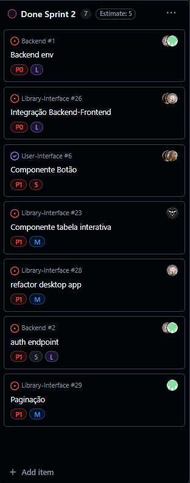

# 2º Sprint (quinzenal)

## Objetivo da sprint:

O objetivo de integrar o backend em Java Spring com a interface do usuário foi alcançado na Sprint 2, garantindo autenticação OAuth funcional, definição de papéis de acesso e integração dos componentes do frontend (como tabelas, paginação e botões) com o fluxo de autenticação e usabilidade.

## Lista de entregas concluídas:

- Backend em Java Spring

- Criar endpoints para autenticação de usuário.

- Definir e documentar os endpoints do banco de dados.

- Implementar repositório de autenticação (OAuth) para integração com login mobile.

- Desenvolver endpoints de "Match".

- Estabelecer papéis (roles) de acesso.

- Implementar sistema de autorização (authorization request).

- Gerar e validar tokens de acesso (access token).

- Frontend / Componentes

- Desenvolver componente de botão reutilizável.

- Criar componente de tabela com funcionalidades de pesquisa, filtragem, adição e remoção de registros.

- Implementar paginação para tabelas.

- Adaptar telas mobile para versão desktop (com base no protótipo do Figma).

- Refatorações

- Refatorar a página inicial (Home).

- Refatorar a página de coleções (Collection).

- Funcionalidades do Usuário

- Construir histórico do lado do usuário (User History).

- Unificar (merge/rebase) páginas de perfil e configuração.

- Criar abas de Favoritos e Notificações para usuários comuns e administradores.

## Indicadores: 

## Impedimentos: 

### Componentização

**Esses itens não puderam ser implementados nesta sprint e ficaram para a próxima:**

- Criação de componentes básicos

- Botões: reservar, cancelar, renovar

- Carrossel de livros

- Código de status: reservado, atrasado, próximo à devolução

- Cards de Notificação

- Cards de Livros (capa, título, autor)

- Card para livros (pendente)

**Parâmetros obrigatórios:**

- Capa do livro

- Título

- Autor

- Informação adicional (data de aluguel, disponível para retirada, etc.)

- Status do livro (reservado, disponível, próximo da multa)

- Descrição

- Botão

- Componente Código de Status (pendente)

- Legenda para facilitar visualização do status do livro

- Cores distintas para cada situação do livro

- Pop-up ao clicar mostrando todas as cores e seus significados

 

Observação: A implementação desses itens será realizada na próxima sprint.

## Próximos passos para a próxima sprint:

### Refatoração de Telas

- Tela de Usuário: ajustar layout, favoritos, notificações e fluxo de login/logout.

- Tela de Biblioteca: melhorar listagem, filtros, pesquisa, botões e paginação.

- Geral: padronizar componentes, revisar design no Figma e garantir responsividade.

## Resumo de rastreabilidade (Issues x PRs x entregas):

### 📌 Rastreabilidade – Backend env (#1)

**Issue Principal**

#1 – Backend env:

- Objetivo: Configurar ambiente backend em Java Spring.

- Status: ✅ Concluído (Sprint 2).

**Sub-Issues:**

#2 – Auth endpoint:

- Responsáveis: @thomasteinhoff, @GuilhermeAmargo

- Status: 🚧 Em andamento

- Commits Relacionados: 9208c6a – build(main auth classes n files #1): structured repos, controllers…

**Entregas Sprint 2:**

- Estrutura inicial do backend criada (repositórios + controllers).

- Ambiente backend configurado.

- Início da implementação dos endpoints de autenticação.

 

### 📌 Rastreabilidade – Integração Backend-Frontend (#26)

**Issue Principal**

#26 – Integração Backend-Frontend: 

- Objetivo: Integrar sistema de autenticação OAuth do backend com página de login mobile.

- Status: ✅ Concluído (Done Sprint 2).

**Milestone: Entrega 3 – Peso 20%**

Tarefas Associadas:

- Integração do backend OAuth com login mobile.

- Ajuste e compatibilização dos endpoints entre backend e frontend.

- Definição de roles (usuário, admin etc.).

- Testes de funcionamento da autenticação integrada.

**Atividade / Histórico:**

- Criado por @ZKNs1 (last week).

- Refinado e priorizado por @thomasteinhoff (Backlog → Sprint).

- Movido para 🚧 In Progress por @ZKNs1.

- Finalizado e movido para ✅ Done Sprint 2 por @GuilhermeAmargo.

Entregas:

- Login mobile integrado ao backend OAuth.

- Roles definidos e vinculados ao fluxo de autenticação.

- Endpoints ajustados e testados.

 

### 📌 Rastreabilidade – Componente Botão (#6)

**Issue Principal**

#6 – Componente Botão:

- Parent: #9 – Componentização

- Objetivo: Desenvolver e revisar componente de botão reutilizável no frontend.

- Status: ✅ Concluído (Done Sprint 2).

**Atividade / Histórico:**

- Criado por @ZKNs1 (2 semanas atrás).

- Transferido do repositório Library-Interface para User-Interface.

- Atribuído a @ZKNs1 e posteriormente a @mwlaofr.

- Associado como sub-issue de Componentização (#9) por @GuilhermeAmargo.

- Workflow: 🚧 In Progress → 🔍 To Review → ✅ Done Sprint 1 → ✅ Done Sprint 2.

**Entregas:**

- Criação de componente de botão padronizado.

- Inclusão no fluxo de componentização do frontend.

- Revisão e aprovação concluídas.

 

### 📌 Rastreabilidade – Componente Tabela Interativa (#23)

**Issue Principal**

#23 – Componente Tabela Interativa:

- Parent: #12 – Componentes Web

- Objetivo: Desenvolver componente de tabela com pesquisa, filtragem, adição e remoção de registros.

- Status: ✅ Concluído (Done Sprint 2).

**Atividade / Histórico:**

- Criado por @GuilhermeAmargo (2 semanas atrás).

- Atribuído a @Vetorazzo.

- Workflow: 🛠 To Do → 🚧 In Progress → Sprint 1 → 🚧 In Progress → ✅ Done Sprint 2.

**Commits relacionados:**

- 1f09b8c – feat #23: table for collection.

- c392d3a – fix #23: fixed table page component style.

**Entregas**

Componente de tabela criado com suporte a:

- 🔍 Pesquisa

- 🔽 Filtragem

- ➕ Adição de registros

- 🗑 Remoção de registros

 

Ajustes de estilo e integração no frontend finalizados.

 

### 📌 Rastreabilidade – Refactor Desktop App (#28)

**Issue Principal**

#28 – Refactor Desktop App:

- Objetivo: Adaptar telas mobile para desktop (com base no protótipo Figma).

- Escopo:

- Refatorar Home

- Refatorar Collection

- Criar User Side History

- Merge/Rebase páginas de Perfil e Configuração

- Implementar abas de Favoritos e Notificações

- Status: ✅ Concluído (Done Sprint 2)

**Milestone: Entrega 3 – Peso 20%**

**Atividade / Histórico:**

- Criado por @thomasteinhoff (há 3 dias).

- Adicionado ao projeto Sistema de Gerenciamento de Biblioteca.

- Workflow: 📋 Backlog → Sprint → Done Sprint 2.

- Responsáveis: @thomasteinhoff → @GuilhermeAmargo.

 

Issue foi concluída e reaberta, depois fechada definitivamente.

**Entregas**

- Telas adaptadas para versão desktop.

- Refatoração de Home e Collection concluída.

- Histórico do usuário implementado.

- Páginas de perfil e configuração unificadas.

- Abas de Favoritos e Notificações entregues.

 

### 📌 Rastreabilidade – Auth Endpoint (#2)

**Issue Principal**

#2 – Auth Endpoint: 

- Parent: Backend env (#1)

- Objetivo: Implementar autenticação para usuários comuns e administradores, incluindo:

- Requisições de autorização (authorization request)

- Geração e validação de tokens de acesso (access token)

- Controle de acesso (access giver)

- Status: ✅ Concluído (Done Sprint 2)

**Atividade / Histórico:**

- Criado por @thomasteinhoff (2 semanas atrás).

- Responsáveis: @thomasteinhoff e @GuilhermeAmargo.

- Workflow: 📋 Backlog → 🛠 To Do → Sprint → ✅ Done Sprint 2.

**Commits relacionados:**

- 53e46cf – build(Fix oauth system #2, #26): Changed auth username request to cpf.

**Entregas**

- Endpoint de autenticação implementado e testado.

- Usuários comuns e administradores autenticados via OAuth.

- Tokens de acesso gerados e validados corretamente.

 

### 📌 Rastreabilidade – Paginação (#29)

**Issue Principal**

#29 – Paginação: 

- Objetivo: Implementar paginação para tabelas no frontend.

- Status: ✅ Concluído (Done Sprint 2)

**Milestone: Entrega 3 – Peso 20%**

**Atividade / Histórico:**

- Criado por @thomasteinhoff (3 dias atrás).

- Atribuído inicialmente a @GuilhermeAmargo e @Vetorazzo.

- Workflow: 📋 Backlog → 🚧 In Progress → Sprint → ✅ Done Sprint 2.

**Commit relacionado:**

- 37bbbef – feat #29: add pagination element in table

**Entregas**

- Componente de tabela atualizado com suporte a paginação.

- Integração completa com funcionalidades de pesquisa, filtragem, adição e remoção de registros.

## Reflexão da equipe: 

### O que funcionou bem: 

- **Auntenticação**

### O que não funcionou:

Analisando de maneira geral, não houve nenhum impedimento quanto a funcionalidade do projeto

### O que pode ser melhorado na próxima sprint: 
 
- **As refatorações das páginas web.**

- **Criação de mais componentes.**