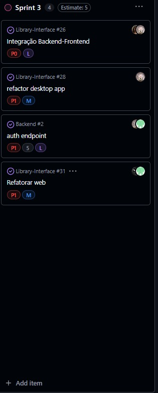

# 3º Sprint (quinzenal)

## Objetivo da sprint:

Foram feitos ajustes na Tela de Usuário (layout, favoritos, notificações e login/logout) e melhorias na Tela de Biblioteca (listagem, filtros, pesquisa, botões e paginação). Também houve padronização de componentes, revisão do design no Figma e ajustes de responsividade no sistema.

## Lista de entregas concluídas:

- Integração do backend OAuth com a página de login mobile.

- Ajuste e correspondência dos endpoints entre frontend e backend.

- Definição e implementação de papéis de usuário (roles).

- Adaptação das telas mobile para o layout desktop (protótipo no Figma).

- Refatoração das telas de Home e Coleções.

- Implementação do Histórico do Usuário.

- Merge/Rebase das páginas de Perfil e Configurações.

- Criação das abas de Favoritos e Notificações para usuários comuns e administradores.

- Implementação do fluxo de autenticação completo:

- Authorization Request

- Access Giver

- Access Token

- Aprimoramento visual de elementos da interface web para melhorar a experiência do usuário.

## Indicadores: 

## Impedimentos: 

### Componentização

**Esses itens não puderam ser implementados nesta sprint e ficaram para a próxima:**

- Componentização

- Tela acervo

 

Observação: A implementação desses itens será realizada na próxima sprint.

## Próximos passos para a próxima sprint:

### Integração

- Tela Acervo e Componentização: Integração do Front-End com Back-End.

## Resumo de rastreabilidade:

### Auth Endpoint (#2):

Feature desenvolvida por @thomasteinhoff.
Implementou o sistema de autenticação para usuários comuns e administradores, incluindo os fluxos de authorization request, access giver e access token.
Durante o desenvolvimento, foi realizado um ajuste no sistema OAuth, alterando a autenticação de username para CPF.
A issue foi concluída na Sprint 2 e posteriormente movida para acompanhamento na Sprint 3.

 

###  Rastreabilidade – Integração Backend-Frontend (#26):

Atividade desenvolvida por @ZKNs1, @thomasteinhoff.
Consistiu na integração do sistema OAuth do backend com a página de login mobile, alinhamento de endpoints e definição de papéis de usuário (roles).
A issue passou por @ZKNs1 (abertura e planejamento), @thomasteinhoff (atribuição e acompanhamento) e foi concluída por @GuilhermeAmargo durante a Sprint 2, sendo depois movida para acompanhamento na Sprint 3.

 

### Refactor Desktop App (#28):

Tarefa conduzida por @thomasteinhoff.
Incluiu a adaptação das telas mobile para o desktop com base no protótipo do Figma, refatoração das páginas Home e Coleções, criação do Histórico do Usuário, unificação das páginas de Perfil e Configurações e implementação das abas de Favoritos e Notificações.
Aberta e executada por @thomasteinhoff, concluída por @GuilhermeAmargo na Sprint 2, e posteriormente movida para acompanhamento na Sprint 3.

 

### Aprimoramento Visual da Interface Web (#31)

Tarefa conduzida por @GuilhermeAmargo e @Vetorazzo, com colaboração de @thomasteinhoff.
Envolveu o aprimoramento visual de elementos da tela web para melhorar a experiência do usuário, incluindo ajustes de estilos globais (global.css), organização de recursos, correção de tabelas e criação das páginas de empréstimo e pagamento.
A issue foi concluída durante a Sprint 3, dentro da Entrega 4 (peso 10%).

## Reflexão da equipe: 

### O que funcionou bem: 

- **Integração geral do projeto (devido a comunicação harmoniosa da equipe).**

- **Finalização de diversas telas do Mobile.**

- **Finalização dos ajustes da interface de usuário do Web.**

### O que não funcionou:

Analisando de maneira geral, não houve nenhum impedimento quanto a funcionalidade do projeto

### O que pode ser melhorado na próxima sprint: 
 
- **Integração do Front e Back (tanto do Mobile quanto Web)**