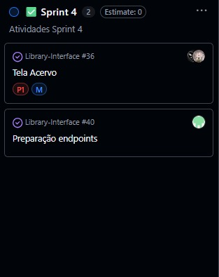

# 4º Sprint (quinzenal)

## Objetivo da sprint:

Refatorar o front-end do sistema, integrar a aplicação com a API e definir as colunas e os dados necessários para cada livro na interface.

## Lista de entregas concluídas:

- Front-end refatorado.

- API integrada.

- Colunas e dados definidos para cada livro.

## Indicadores: 

## Impedimentos: 

### **Sem impedimentos**

## Próximos passos para a próxima sprint:

- Tela para registro de usuário

- Validação da nova interface.

## Resumo de rastreabilidade:

### A issue Acervo (#36):

Foi criada por @thomasteinhoff há 3 semanas para refatorar o front, integrar a API e definir as colunas dos livros. Ela foi marcada como feature e enhancement, adicionada ao projeto e ao milestone Entrega 3, atribuída a @thomasteinhoff e @Vetorazzo, movida para In Progress e depois para Sprint 4. Por fim, foi concluída e fechada por @GuilhermeAmargo.

 

###  A issue Preparação endpoints (#40):

Foi aberta por @GuilhermeAmargo para preparar o front-end para integração com o back-end. Ela foi adicionada ao projeto e ao Sprint 4, marcada como feature e enhancement, atribuída ao próprio autor e vinculada ao milestone Entrega 4. Em seguida, foi rapidamente concluída e fechada.

 

## Reflexão da equipe: 

### O que funcionou bem: 

- **A refatoração da interface.**

### O que não funcionou:

Analisando de maneira geral, não houve nenhum impedimento quanto a funcionalidade do projeto.